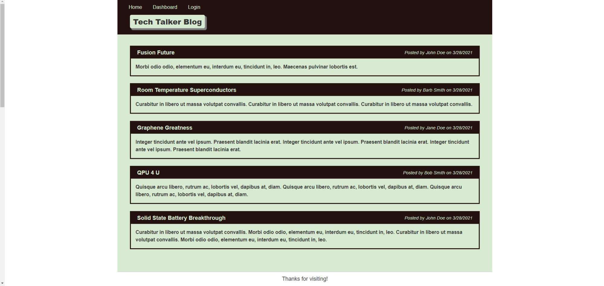

# Tech Talker Blog

## Description

This repo contains a nodejs based blog cms application. Complete with account, posting, commenting and other functionality to keep you and like minded individuals up to date on the latest tech articles and news from around the world.

## Table of Contents

* [Installation](#installation)

* [Usage](#usage)

* [Credits](#credits)

* [License](#license)

 

* Displays a list of user generated posts
* Allows for account creation
* Allows for post commenting
* Allows user to delete previous post and comments

 

This blogging app is intended to provide a fun environment for tech geeks to drop some knowledge for others to catch up on.

 

[Tech Talker Blog](https://tech-talker-blog.herokuapp.com/)

***

## Installation

To run Note Were Thee, either follow the link above or you can copy/clone/fork this repository. Make sure to install the Express, Uniqid, and fs libraries. "npm init" to intialiaze the package manager followed by "npm install {dependency}". This will setup the necesary packages required.

***

## Usage

This application is used to create a timeline of tech current events. The minimalist interface is ideal for a quick workflow, an important aspect for any tech junkie. Create an account today and let us know about those hidden gems.

 

***

## Credits

W3Schools for always being there | 
[W3Schools](https://www.w3schools.com/)

 

***

## License

All Rights Reserved.
